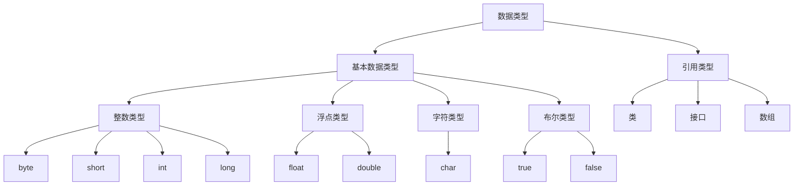

看各种视频教程出来的大杂烩笔记，对他人作用估计不大。内容：数据类型
<!-- more -->
# 数据类型

- **强类型语言**
  - 要求变量的使用要严格符合规定，所有变量必须先定义后使用
    - Java、.net、Python、C++


- **弱类型语言**
  - 定义变量的时候不需要声明类型，一个变量可以存储所有类型的值并且不丢失数据
    - PHP，JavaScript

**Java的数据类型分两类：基本类型、引用类型**
  



## 八大基本数据类型

```java
  //整数类型
  byte byteNumber = 10;			//byte数据类型是8位(1个字节)，范围：(-128)～(127)
  short shortNumber = 20;			//short数据类型是16位(2个字节)，范围(-32768)～(32767)
  int intNumber = 30;				//int数据类型是32位(4个字节)，范围(-2,147,483,648)～(2,147,483,647)
  long longNumber = 40L;			//long数据类型是64位(8个字节)，范围(-9,223,372,036,854,775,808)～(9,223,372,036,854,775,807),末尾加L作为区分
  //浮点类型
  float floatNumber = 3.4F;		//单精度、32位(4个字节)，默认为double型，若要使用float需要在末尾加F
  double doubleNumber = 6.18;		//双精度、64位(8个字节)
  //字符类型
  char A1 = 'A';					//占2个字节，只能存一个字符：字母，数字，字，符号：'A','中'	(String 不是关键字，是类)
  //布尔类型
  boolean A1 = true;				//占用1位，只有 true 和 false 两个值
```

## 引用类型

**引用类型,是指除了基本的变量类型之外的所有类型**

- 类
- 接口
- 数组

### 扩展

- 整数进制
```java
int i1 = 0b10;       //二进制0b	0-1，满2进1        输出为2
int i2 = 010;        //八进制0     0-7,满8进1         输出为8
int i3 = 10;		 //十进制      0-9,满10进1        输出为10
int i4 = 0x10;       //十六进制0x   0-9 A-F,满16进1    输出为16
```

- 浮点数计算与比较
```java
float f = 0.1f；
double d = 1.0/10；
f==d 为 false
//很多值浮点数都是采用其能够表示的离目标值最近的数来表示
//应避免使用浮点数进行比较，因为浮点数有舍入误差
//若是需要浮点计算，使用java.math.BigDecimal类
```

- 字符
```java
//所有字符来自Unicode编码表，U0000-UFFFF
char c1 = 'a';        //输出为a
char c2 = '\u0061';   //输出为a
//转义字符
\t //制表符
\n //换行
```

- 布尔
```java
boolean flag = true;
if(flag == true){}
if(flag){}
//两个等值
```

## 类型转换

- 由于Java是强类型语言，所以在计算时需要进行类型转换

**强制类型转换 （类型）变量名   高精度→低精度**
```java
int i = 127;
byte b = (byte)i;		//强转时要注意支持的范围，会导致内存溢出

int c = 98;
char d = (char)c;
//不要随意使用强制转换，从高精度到低精度，隐含了精度损失问题
```

**隐式转换（自动类型转换）    低精度→高精度**
  - 数值型数据的转换：byte→short→int→long→float→double。
  - 字符型转换为整型：char→int。
```java
float price1 = 10.9f; // 定义牙膏的价格
double price2 = 5.8; // 定义面巾纸的价格
int num1 = 2; // 定义牙膏的数量
int num2 = 4; // 定义面巾纸的数量
double res = price1 * num1 + price2 * num2; // 输出为44.99999923706055
/*
float、int 和 double 三种数据类型参与运算，最后输出的结果为 double 类型的数据。这种转换一般称为“表达式中类型的自动提升”
*/
```

- 注意点 
    1. 不能对布尔值进行转换
    2. 不能把对向类型转换为不相干的类型
    3. 在高精度类型转低精度类型时需要强制转换
    4. 在转换时可能会遇到内存溢出或精度损失问题

### 扩展

```java
int money = 10_0000_0000;		//java7特性，数字间可以用下划线分割;
int years = 20;
int total1 = money*years;			//输出为-1474836480，计算时溢出了
long total2 = money*years;			//输出为-1474836480，因为先在int时计算，然后再转为long
long total3 = money*((long)years);			//输出为20000000000，先将一个数强转为long
```

