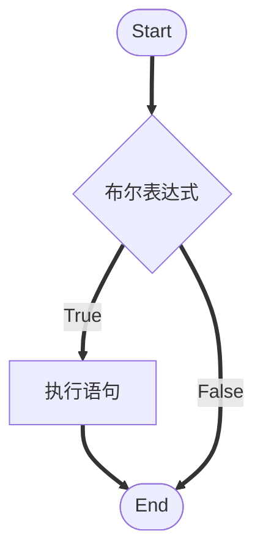
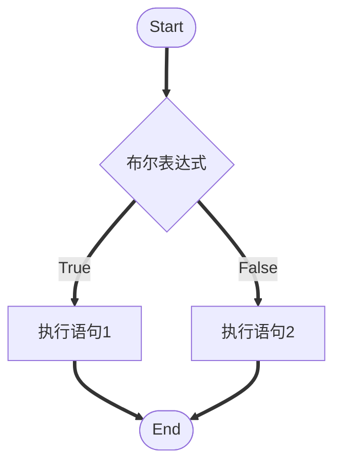

看各种视频教程出来的大杂烩笔记，对他人作用估计不大。内容：选择结构
<!-- more -->

# 选择结构

## if语句

### 单选择结构




``` JAVA
if{布尔表达式}(
    //如果为true将执行的语句
)
```

### 双选择结构




```JAVA
if{布尔表达式}(
    //如果为true将执行的语句
)else{
    //如果为false将执行的语句
}
```


### 多选择结构


```JAVA
        if (布尔表达式1) {
            //如果布尔表达式1为true将执行的语句
        } else if (布尔表达式2) {
            //如果布尔表达式2为true将执行的语句
        } else if (布尔表达式3) {
            //如果布尔表达式3为true将执行的语句
        } else if (布尔表达式4) {
            //如果布尔表达式4为true将执行的语句
        } else {
            //如果所有布尔表达式都为false将执行的语句
        }
```


### 嵌套if选择结构


```JAVA
if(布尔表达式1){
	if(布尔表达式2){
		//如果布尔表达式1和布尔表达式2为true,同时满足将执行的语句
	}else{
		//如果布尔表达式1为true和布尔表达式2为false,同时满足将执行的语句
	}
}else{
	//如果布尔表达式1和布尔表达式2为false,同时满足将执行的语句
}

```
## switch语句
- 判断一个变量与一系列值中某个值是否相等，若相等则执行对应语句。每个值称为一个分支
- switch case 执行时，一定会先进行匹配，匹配成功返回当前 case 的值，再根据是否有 break，判断是否继续输出，或是跳出判断。
- 如果 case 语句块中没有 break 语句时，并不会顺序输出每一个 case 对应的返回值，而是继续匹配，匹配不成功则返回默认 case。
- 如果 case 语句块中没有 break 语句时，匹配成功后，从当前 case 开始，后续所有 case 的值都会输出。


[switch case语句](https://www.runoob.com/java/java-switch-case.html)

```JAVA
switch(表达式){
    case value1:
    //执行语句1
    break; //跳出 switch 语句，可选
    case value2:
    //执行语句2
    break; //跳出 switch 语句，可选
    case value3:
    //执行语句3
    break; //跳出 switch 语句，可选
    default : //可选，default 在没有 case 语句的值和变量值相等的时候执行。default 分支不需要 break 语句。
    //执行语句4
}

```